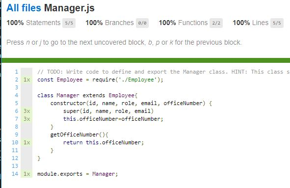

<!-- PROJECT LOGO -->
<br />
<p align="center">
  https://github.com/mygithub/MyRepoName
  <br />
   

  <h3 align="center">Project Title</h3>

  <p align="center">
    <a href="https://github.com/mygithub/MyRepoName"><strong>Explore the docs »</strong></a>
    <br />
    <br />
    <a href="https://github.com/mygithub/MyRepoName">View Demo</a>
    ·
    <a href="https://github.com/mygithub/MyRepoName/issues">Report Bug</a>
    ·
    <a href="https://github.com/mygithub/MyRepoName/issues">Request Feature</a>
  </p>
</p>


<!-- TABLE OF CONTENTS -->
<details open="open">
  <summary><h2 style="display: inline-block">Table of Contents</h2></summary>
  <ol>
    <li>
      <a href="#Screenshot">Screenshots</a>
      <ul>
        <li><a href="#Demo">Project Demo</a></li>
      </ul>
    </li>
    <li>
      <a href="#Short-Description">Project Objective</a>
      <ul>
        <li><a href="#Project-Description">Project Description</a></li>
      </ul>
    </li>
    <li>
      <a href="#getting-started">Getting Started</a>
      <ul>
        <li><a href="#prerequisites">Prerequisites</a></li>
        <li><a href="#Technologies">Technologies</a></li>
        <li><a href="#installation">Installation</a></li>
      </ul>
    </li>
    <li><a href="#usage">Usage</a></li>
    <li><a href="#How-to-test">How to Test</a></li>
    <li><a href="#license">License</a></li>
    <li><a href="#contact">Contact</a></li>
  </ol>
</details>

##Title

Project Title

## Screenshots


```
Elegant Style
```


### ✨Demo

Project Link: [https://github.com/mygithub/mygithub23/Github-README.me-Builder](https://github.com/mygithub/MyRepoName)
https://github.com/mygithub/MyRepoName<br>


<!-- ABOUT THE PROJECT -->

## Project Objective
 Employee record keeper provide CLI to enter a new employee information and also it generate a portal to view all employees information.

## Preject Description

We can use Inquirer for this. The module includes a number of methods for various types of prompts, which are roughly analogous to HTML form controls. In order to collect the user’s GitHub username and password, we’re going to use the input and password types respectively.
The next thing we need to do is create a function that will prompt the user for their GitHub credentials.

We can use Inquirer for this. The module includes a number of methods for various types of prompts, which are roughly analogous to HTML form controls. In order to collect the user’s GitHub username and password, we’re going to use the input and password types respectively.
The next thing we need to do is create a function that will prompt the user for their GitHub credentials.

We can use Inquirer for this. The module includes a number of methods for various types of prompts, which are roughly analogous to HTML form controls. In order to collect the user’s GitHub username and password, we’re going to use the input and password types respectively.
The next thing we need to do is create a function that will prompt the user for their GitHub credentials.

Require steps We can use Inquirer for this. The module includes a number of methods for various types of prompts, which are roughly analogous to HTML form controls. In order to collect the user’s GitHub username and password, we’re going to use the input and password types respectively.

### Prerequisites
Nodejs, jest, inquirer

## Technologies 
```
Nodejs, javascript, inquirer, chalk, figlet, clear
```

## Installation
Download or clone the project.

From root directory of the project run $ npm install
once all dependencies are installed run $ node app.js
## Usage 
```
How to use the project - We can use Inquirer for this. The module includes a number of methods for various types of prompts, which are roughly analogous to HTML form controls. In order to collect the user’s GitHub username and password, we’re going to use the input and password types respectively.
```

## How to test
```
on root directory run the following command: $npm test
if the test was successful jest will diplay the test report for code coverage (see picture below)
```


```
And if you are a visual person you can review the test report for code coverage on the browser. There is a folder called coverage, inside this folder a file called index.html. Just open index.html and you will see test report for code coverage. (see example below)  
```


```
```


```
```

<!-- LICENSE -->
## License
This project is [MIT](https://choosealicense.com/licenses/MIT/) licensed.<br />

  Copyright © 2021 [Ali Alaoui}](https://github.com/mygithub})
  


<!-- CONTACT -->
## Contact
Contact the author with any questions!<br>
* Twitter:      [@myTwitterHandle](https://twitter.com/@myTwitterHandle)
* Github link:  @[mygithub](https://github.com/mygithub)<br>
* Email:        ali.alaoui@gmail.com
